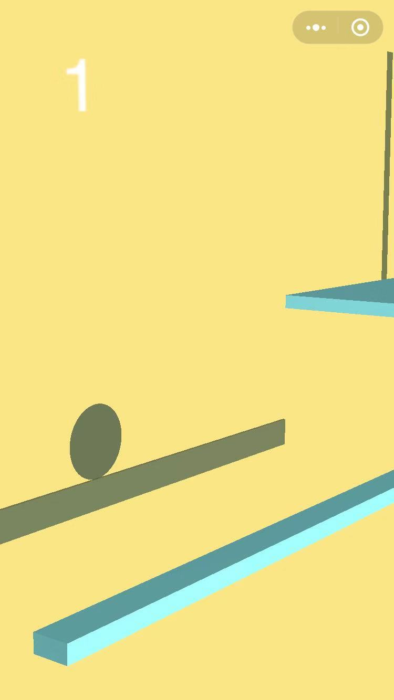
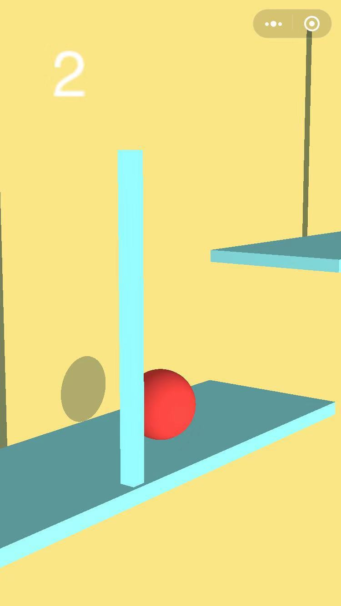

# BallGame
A 3d mobile game, using WebGL with the library Three.js and Oimo.js physics engine, designed for WeChat APP.

## How to play
Try to slide left/right, touch & hold the screen.

 &nbsp;&nbsp;&nbsp;&nbsp;&nbsp;&nbsp;&nbsp;&nbsp;&nbsp;&nbsp;&nbsp;&nbsp;&nbsp;&nbsp;&nbsp;&nbsp;&nbsp;&nbsp;  

(未完成的微信小游戏项目)

